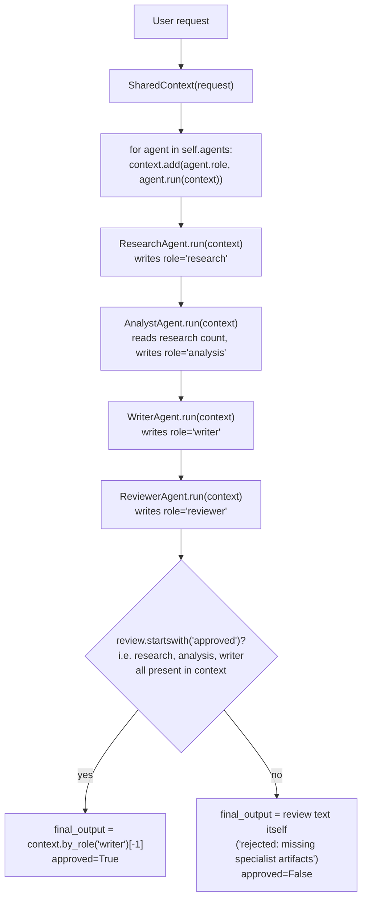
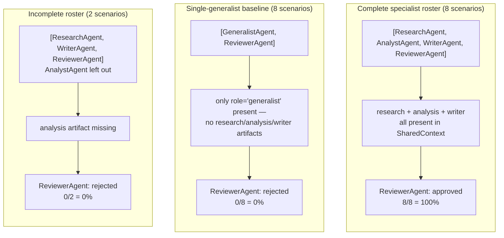

# Architecture Decision Record: Multi-Agent System Pattern

## Context

Large AI workflows need different perspectives — research, analysis, writing, review, domain validation, data ops, customer context. One agent can try to cover all of it, but the result is hard to tune, observe, secure, or scale. Split the work into specialized roles under an orchestrator instead.

## Decision

This repo implements a centralized multi-agent system:

1. `SharedContext` stores request-level artifacts.
2. Specialist agents produce role-specific outputs.
3. `MultiAgentOrchestrator` decides execution order.
4. `ReviewerAgent` gates the final output.

The orchestrator is intentionally centralized — that's the right default for enterprise systems: clear control over sequencing, policy enforcement, cost, and auditability.

## When To Use

Use this pattern when the task naturally decomposes by expertise:

- Enterprise automation.
- Knowledge-intensive workflows.
- Data pipeline assistance.
- Customer support and account intelligence.
- Research-to-report systems.
- Cross-functional decision support.

Avoid this pattern for simple requests where agent specialization adds coordination cost without improving quality.

## Runtime Flow

```text
User request
  -> orchestrator creates shared context
  -> research agent writes evidence
  -> analyst agent interprets evidence
  -> writer agent drafts output
  -> reviewer agent approves or rejects
  -> orchestrator returns final output
```

The diagram below is the same flow drawn from the actual code in
`src/multi_agent_system_pattern/orchestrator.py`
(`MultiAgentOrchestrator.run()`): agents run **in the order they were
constructed**, each one only reads/writes `SharedContext`, and the
`ReviewerAgent`'s approval is a plain presence-check — not a judgment call —
on which roles already wrote an artifact.



Two things worth being explicit about, since the diagram makes them visible
where the prose could gloss over them:

- Agent order is **whatever order the caller passed into
  `MultiAgentOrchestrator(agents)`** — the orchestrator does not reorder or
  schedule by dependency; it just iterates `self.agents` and appends each
  result to `SharedContext`.
- The reviewer gate is a **mechanical completeness check**
  (`ReviewerAgent.run()` looks for non-empty `by_role("research")`,
  `by_role("analysis")`, and `by_role("writer")`), not a quality judgment —
  it approves an empty-but-present artifact from each role just as readily
  as a good one.

## Reviewer Gate: Orchestrator vs. Single-Generalist Baseline (Benchmark)

`scripts/benchmark_reviewer_gate.py` runs 20 real scenarios against the
actual `MultiAgentOrchestrator` / `ReviewerAgent` / `SharedContext` code
above. It adds one new baseline — `GeneralistAgent` (in
`src/multi_agent_system_pattern/benchmark.py`) — that answers a request
directly, in one pass, instead of producing separate research/analysis/writer
artifacts. Full receipt: [`docs/receipts/benchmark.md`](receipts/benchmark.md).



**Real headline numbers, both measured against the same unmodified
`ReviewerAgent.run()`:**

- Complete specialist roster: reviewer gate passes **100%** of scenarios (8/8).
- Single-generalist baseline, same gate: **0%** (0/8).
- Orchestrator with `AnalystAgent` deliberately left out: also **0%** (0/2) —
  the gate rejects an incomplete roster the same way it rejects a generalist
  that never produced role-tagged artifacts in the first place.

A separate duplicate-role-guard check (2/2 scenarios) confirms
`MultiAgentOrchestrator.__init__`'s `ValueError("Agent roles must be
unique")` fires on construction, not silently at runtime.

This benchmark measures the reviewer gate's **mechanical** presence-check
behavior, not real output quality — every `Agent` here, including
`GeneralistAgent`, is a deterministic stub with no external API calls, same
as the rest of this repo.

## State Model

Shared context should be explicit and typed. Production implementations should distinguish:

- Conversation/request state.
- Agent artifacts.
- Source citations and evidence.
- Decisions and approvals.
- Tool calls and side effects.
- Long-term memory or tenant knowledge.

Agents should not communicate through hidden prompts alone. Shared state is the system contract.

## Guardrails

- Unique role names.
- Orchestrator-controlled execution order.
- Review gate before final output.
- Shared context as observable memory.

Recommended production additions:

- Per-agent permissions and tool scopes.
- Agent-level budgets.
- Artifact schemas per role.
- Reviewer escalation to humans.
- Dead-letter handling for failed agent tasks.
- Distributed tracing across all agent calls.

## Failure Modes

- Coordination overhead: too many agents increase latency and cost. Mitigation: specialize only where role separation improves outcomes.
- Context pollution: weak artifacts degrade downstream agents. Mitigation: artifact schemas and quality gates.
- Role ambiguity: agents duplicate work or conflict. Mitigation: crisp role contracts.
- Orchestrator bottleneck: centralized control can limit adaptability. Mitigation: shard workflows or graduate to swarm-like coordination only when autonomy justifies it.

## Scaling Strategy

Begin with sequential orchestration. Move independent agents to parallel execution when their inputs do not depend on each other. For durable production workflows, run each agent as a worker behind a queue and persist artifacts in a workflow database or event log.

## Success Metrics

- Final approval rate.
- Per-agent artifact quality.
- Coordination latency.
- Cost per role.
- Review rejection categories.
- Human escalation rate.
- Reuse rate of specialist agents across workflows.

